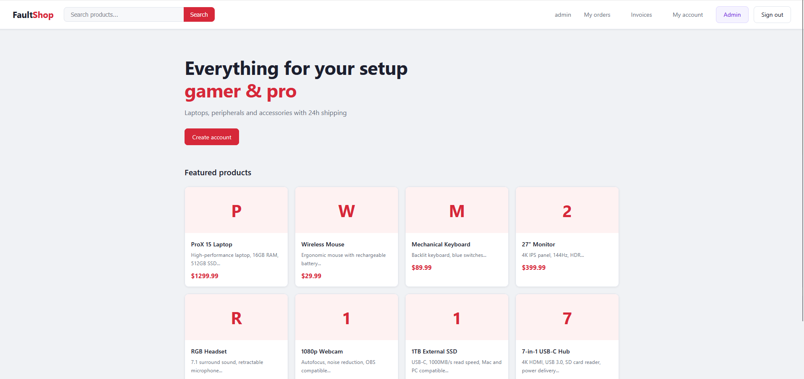

# FaultShop
[](https://hub.docker.com/r/cbeltranh/faultshop)
[](https://hub.docker.com/r/cbeltranh/faultshop)
[](https://creativecommons.org/licenses/by-nc/4.0/)
[](https://github.com/CesarBeltran/faultshop)

**Intentionally vulnerable environment for ethical web hacking practice**

FaultShop is a deliberately vulnerable online store, designed for cybersecurity students and professionals to practice ethical hacking techniques in a safe, controlled environment.

> Based on the OWASP Top 10:2025 and OWASP API Security Top 10:2023, FaultShop
> covers the attack vectors relevant to **modern** web applications and APIs,
> where each vulnerability replicates real-world audit scenarios.

---

## Preview


*Product catalog — modern interface designed to replicate a real store*

---

## Features

- 18 real, documented and confirmed vulnerabilities
- Modern, realistic interface — does not look like a practice lab
- Includes a REST API with its own vulnerabilities
- Internal mail server (MailHog) to practice password reset attacks
- Built-in reset button — restores the lab to clean data in seconds
- 100% containerized with Docker — no complex setup required

---

## Included vulnerabilities

| # | Vulnerability | OWASP category |
|---|---|---|
| 1 | SQL Injection | A05:2025 |
| 2 | Reflected XSS | A05:2025 |
| 3 | Stored XSS | A05:2025 |
| 4 | IDOR | A01:2025 |
| 5 | Path Traversal | A01:2025 |
| 6 | Command Injection | A05:2025 |
| 7 | CSRF | A02:2025 |
| 8 | Insecure password reset | A07:2025 |
| 9 | JWT without signature verification | A07:2025 |
| 10 | Mass Assignment | A08:2025 |
| 11 | SSRF | A01:2025 |
| 12 | Unrestricted file upload | A02:2025 |
| 13 | Brute force without rate limiting | A07:2025 |
| 14 | Unauthenticated API endpoint | A01:2025 |
| 15 | Sensitive data in plaintext | A04:2025 |
| 16 | Missing security headers | A05:2025 |
| 17 | Debug mode / exposed stack trace | A10:2025 |
| 18 | Broken Function Level Authorization | API5:2023 |

---

## Requirements

- Docker
- Docker Compose

No additional installation required.

---

## Installation and usage

### Start the lab

A single command starts FaultShop and MailHog:

```bash
curl -sO https://raw.githubusercontent.com/CesarBeltran/faultshop/main/docker-compose.yml && docker compose up -d
```

Or if you already have the repository cloned:

```bash
git clone https://github.com/CesarBeltran/faultshop.git
cd faultshop
docker compose up -d
```

### Access

| Service | URL |
|---|---|
| FaultShop | http://localhost:5000 |
| MailHog (emails) | http://localhost:8025 |

### Test users

| Username | Password | Role | Balance |
|---|---|---|---|
| admin | admin123 | admin | $0 |
| carlos | password1 | user | $200 |
| ana | ana2024 | user | $150 |
| pedro | 123456 | user | $50 |
| maria | maria1234 | user | $75 |

### Reset the lab

To restore initial data without restarting Docker, use the **Reset lab** button on the sign-in page, or go directly to:
http://localhost:5000/setup

### Stop the lab

```bash
docker compose down
```

---

## Tech stack

- **Backend:** Python / Flask
- **Database:** SQLite
- **Frontend:** HTML / CSS vanilla
- **Containers:** Docker + Docker Compose
- **Email:** MailHog

---

## Recommended tools

- Burp Suite
- sqlmap
- ffuf
- Hydra
- curl
- Netcat

---

## Legal notice

FaultShop is a practice environment designed exclusively for educational purposes. All vulnerabilities are intentional.

- Use only in local or controlled lab environments
- Do not expose the container to public networks or the internet
- Do not enter real personal data in the lab
- The author is not responsible for misuse of this software

---

## Author

**Cesar Beltran**
GitHub: [@CesarBeltran](https://github.com/CesarBeltran)

---

## License

This project is licensed under [Creative Commons Attribution-NonCommercial 4.0 International (CC BY-NC 4.0)](https://creativecommons.org/licenses/by-nc/4.0/).

You are free to:
- Use and modify this project freely
- Distribute it for non-commercial educational purposes
- Adapt it for your classes or personal practice

You may not:
- Sell this project or include it in commercial products without the author's explicit permission
- Sublicense the work

For commercial use, contact the author.

[](https://creativecommons.org/licenses/by-nc/4.0/)
